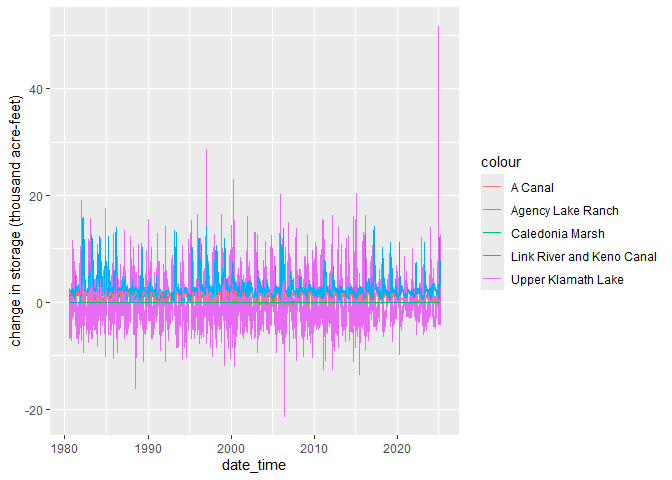
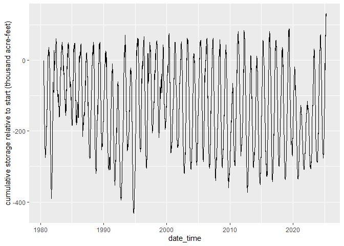
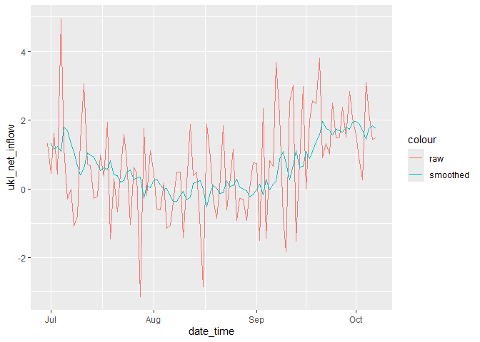

Upper Klamath Lake Net Inflow
================
Skyler Lewis
2025-04-01

- [Generate UKR Net Inflow](#generate-ukr-net-inflow)
- [USGS Data Import](#usgs-data-import)
- [Upper Klamath Lake Storage](#upper-klamath-lake-storage)
  - [UKL Elevation-Capacity Rating
    Curves](#ukl-elevation-capacity-rating-curves)
  - [UKL Active Storage Time Series](#ukl-active-storage-time-series)
- [Other Inflows and Outflows](#other-inflows-and-outflows)
  - [Link River - Keno Canal](#link-river---keno-canal)
  - [A Canal (USBR)](#a-canal-usbr)
  - [Agency Lake Ranch](#agency-lake-ranch)
  - [Caledonia Marsh](#caledonia-marsh)
- [Combine All](#combine-all)
  - [Smoothing](#smoothing)
- [Generate observed and simulated Agency Lake Barnes trailing
  sum](#generate-observed-and-simulated-agency-lake-barnes-trailing-sum)
- [Generate normalized and trailing ukl net
  inflow](#generate-normalized-and-trailing-ukl-net-inflow)

``` r
library(tidyverse)
```

    ## Warning: package 'purrr' was built under R version 4.4.1

    ## Warning: package 'lubridate' was built under R version 4.4.1

    ## ── Attaching core tidyverse packages ──────────────────────── tidyverse 2.0.0 ──
    ## ✔ dplyr     1.1.4     ✔ readr     2.1.5
    ## ✔ forcats   1.0.0     ✔ stringr   1.5.1
    ## ✔ ggplot2   3.5.1     ✔ tibble    3.2.1
    ## ✔ lubridate 1.9.3     ✔ tidyr     1.3.1
    ## ✔ purrr     1.0.2     
    ## ── Conflicts ────────────────────────────────────────── tidyverse_conflicts() ──
    ## ✖ dplyr::filter() masks stats::filter()
    ## ✖ dplyr::lag()    masks stats::lag()
    ## ℹ Use the conflicted package (<http://conflicted.r-lib.org/>) to force all conflicts to become errors

``` r
library(dplyr)

# install.packages("dataRetrieval")
library(dataRetrieval)
```

    ## Warning: package 'dataRetrieval' was built under R version 4.4.2

## Generate UKR Net Inflow

This R Markdown script is used to generate UKR Netinflow inputs for NWI.
Inputs:

- UKL Bathmytry (data-raw”/elev_cap/ukl_bathy.csv)
- Keno flow (data-raw/other_flows/keno_suppl_flows.csv)
- Agency Lake Ranch Calculation
  (data-raw/other_flows/agency_lake_ranch_calcs.csv)
- Caledonia March flow (data-raw/other_flows/from_caledonia_marsh.csv)
- Agency Lake Barnes trailing sum
  (data/ukr_net_inflow/trailing_sum_agency_lake_barnes_wy_1991_2022.csv)
- UKL net inflow after accounting for ALB reconnection in PA simulation
  (data/ukr_net_inflow/l1_taf.csv)

Outputs:

- Smoothed net inflow (data/ukr_net_inflow/combined_net_inflow.csv)
- Observed and Simulated trailing agency lake barnes trailing sum
  (data/ukr_net_inflow/obs_sim_trailing_sum_agency_lake_barnes.csv)
- Normalized 30 day trailing sum
  (data/ukr_net_inflow/net_inflow_export.csv)

TODO: Set start and end date. Default start_date is 1980-06-29, and
default end_date is Sys.Date().

``` r
start_date <- ymd("1980-06-29")
end_date <- Sys.Date()
```

## USGS Data Import

``` r
get_usgs_data <- function(site_number, parameter, statistic, start_date, end_date, workspace = here::here("data-raw", "usgs")) {
  
  parm_code <- sprintf("%05d", parameter)
  stat_code <- sprintf("%05d", statistic)
  
  filename <- str_glue("usgs_{site_number}_{parm_code}_{stat_code}_{format(start_date, '%Y%m%d')}_{format(end_date, '%Y%m%d')}.Rds")
  filepath <- file.path(workspace, filename)
  message(filepath)
  
  if(!dir.exists(workspace)) {
    dir.create(workspace, recursive = T)
  }
  
  if(!file.exists(filepath)) {
    data_raw <- dataRetrieval::readNWISdata(siteNumbers = site_number,
                                            parameterCd = parm_code,
                                            startDate = start_date,
                                            endDate = end_date)
    data_raw |> saveRDS(filepath)
  } else {
    data_raw <- readRDS(filepath)
  }
  
  data_raw |>
    rename(value = !!sym(str_glue("X_{parm_code}_{stat_code}")),
           cd = !!sym(str_glue("X_{parm_code}_{stat_code}_cd"))) |>
    dplyr::select(date_time = dateTime, value, cd)
}
```

USGS data-value qualification codes:

- A = Approved for publication – Processing and review completed.
- P = Provisional data subject to revision.

``` r
# USGS  11507001  UPPER KLAMATH LAKE NR K.FALLS(WEIGHT/MEAN ELEV) OR
# Lake or reservoir water surface elevation above NAVD 1988, feet
ukl_navd88 <- get_usgs_data(11507001, 62615, 00003, start_date, end_date)
```

    ## C:/Users/Inigo/Projects/riverware-nwi/data-raw/usgs/usgs_11507001_62615_00003_19800629_20250401.Rds

``` r
# Lake or reservoir elevation above United States Bureau of Reclamation Klamath Basin (USBRKB) Datum, feet
ukl_usbrkb <- get_usgs_data(11507001, 72275, 00003, start_date, end_date)
```

    ## C:/Users/Inigo/Projects/riverware-nwi/data-raw/usgs/usgs_11507001_72275_00003_19800629_20250401.Rds

``` r
# USGS  11507500    LINK RIVER AT KLAMATH FALLS, OR
# Discharge, cubic feet per second
link_q <- get_usgs_data(11507500, 00060, 00003, start_date, end_date)
```

    ## C:/Users/Inigo/Projects/riverware-nwi/data-raw/usgs/usgs_11507500_00060_00003_19800629_20250401.Rds

``` r
# USGS  11507501  LINK RIVER BELOW KENO CANAL, NEAR KLAMATH FALLS, OR
# Discharge, cubic feet per second
link_keno_q <- get_usgs_data(11507501, 00060, 00003, start_date, end_date)
```

    ## C:/Users/Inigo/Projects/riverware-nwi/data-raw/usgs/usgs_11507501_00060_00003_19800629_20250401.Rds

## Upper Klamath Lake Storage

### UKL Elevation-Capacity Rating Curves

#### UKL Bathymetry

UKL bathymetry measured in 2023 Tech Memo: w/ Tulana and Goose Bay, w/o
Caledonia or ALB

``` r
ukl_bathy <- read_csv(here::here("data-raw", "elev_cap", "ukl_bathy.csv")) |>
  glimpse()
```

    ## Rows: 1001 Columns: 5
    ## ── Column specification ────────────────────────────────────────────────────────
    ## Delimiter: ","
    ## dbl (4): ukl_ft_navd88, ukl_ft_usbrkb, tot_cap_taf, act_cap_taf
    ## num (1): inund_area_ac
    ## 
    ## ℹ Use `spec()` to retrieve the full column specification for this data.
    ## ℹ Specify the column types or set `show_col_types = FALSE` to quiet this message.

    ## Rows: 1,001
    ## Columns: 5
    ## $ ukl_ft_navd88 <dbl> 4138.00, 4138.01, 4138.02, 4138.03, 4138.04, 4138.05, 41…
    ## $ ukl_ft_usbrkb <dbl> 4135.99, 4136.00, 4136.01, 4136.02, 4136.03, 4136.04, 41…
    ## $ tot_cap_taf   <dbl> 266.677, 267.304, 267.931, 268.559, 269.188, 269.817, 27…
    ## $ act_cap_taf   <dbl> NA, 0.000, 0.627, 1.256, 1.884, 2.514, 3.143, 3.774, 4.4…
    ## $ inund_area_ac <dbl> 62626, 62707, 62775, 62839, 62900, 62960, 63018, 63074, …

#### Raw Elevation Capacity Curves

Elevation capacity data for areas that have been, or may in the future
be, temporarily or permanently re-connected to UKL.

cal = Caledonia (See file “Caledonia 14Oct2016.xlsx”) tul = Tulana (See
file “Tulana Nov2016.xlsx”) goo = Goose Bay (See file “GooseBay
Nov2016.xlsx”) alb = Agency Lake Barnes (ALB) (See file “Agency Lake
Barnes ET for KBPM v3 Aug2023 revised UKL net inflow.xlsx”)

``` r
elev_cap <- 
  read_csv(here::here("data-raw", "elev_cap", "elev_cap.csv")) |>
  glimpse()
```

    ## Rows: 1000 Columns: 9
    ## ── Column specification ────────────────────────────────────────────────────────
    ## Delimiter: ","
    ## dbl (3): ukl_ft_usbrkb, af_alb, ac_alb
    ## num (6): af_cal, ac_cal, af_tul, ac_tul, af_goo, ac_goo
    ## 
    ## ℹ Use `spec()` to retrieve the full column specification for this data.
    ## ℹ Specify the column types or set `show_col_types = FALSE` to quiet this message.

    ## Rows: 1,000
    ## Columns: 9
    ## $ ukl_ft_usbrkb <dbl> 4136.00, 4136.01, 4136.02, 4136.03, 4136.04, 4136.05, 41…
    ## $ af_cal        <dbl> 0, 21, 40, 61, 80, 101, 120, 141, 161, 181, 201, 222, 24…
    ## $ ac_cal        <dbl> 2003, 2005, 2007, 2008, 2010, 2012, 2014, 2016, 2017, 20…
    ## $ af_tul        <dbl> 0, 21, 41, 62, 82, 103, 123, 144, 165, 186, 206, 227, 24…
    ## $ ac_tul        <dbl> 2023, 2029, 2037, 2054, 2060, 2065, 2068, 2071, 2074, 20…
    ## $ af_goo        <dbl> 0, 0, 0, 0, 1, 1, 1, 1, 1, 1, 1, 1, 2, 2, 2, 2, 2, 2, 3,…
    ## $ ac_goo        <dbl> 13, 13, 13, 13, 13, 13, 14, 14, 14, 14, 14, 14, 14, 15, …
    ## $ af_alb        <dbl> 0.00000, 25.60953, 51.21906, 76.82859, 102.43812, 128.04…
    ## $ ac_alb        <dbl> 2313.017, 2363.434, 2413.851, 2464.267, 2514.684, 2565.1…

``` r
# af = active storage volume (af)
# ac = inundated area (ac)

area_codes <- c("Caledonia" = "cal",
                "Tulana" = "tul",
                "Goose Bay" = "goo",
                "Agency Lake Barnes" = "alb")

# elev_cap |>
#   pivot_longer(cols = c(starts_with("af_"), starts_with("ac_"))) |>
#   separate_wider_delim(name, "_", names = c("name", "area_code")) |>
#   mutate(name = factor(name, 
#                        levels = c("af", "ac"), 
#                        labels = c("act_stor_vol_af", "inund_area_ac")),
#          site = factor(area_code, 
#                        levels = area_codes,
#                        labels = names(area_codes))) |>
#   pivot_wider()
```

#### Elevation Capacity for Storage Scenarios

- `s0`: Baseline: UKL w/o Caledonia, Tulana, Goose Bay or ALB
  - Caledonia reconnected 7/8/2006-12/31/2006
- `s1`: UKL w/ Caledonia, w/o Tulana, Goose Bay or ALB
  - Tulana reconnected 10/31/2007-forward
- `s2`: UKL w/ Tulana, w/o Caledonia, Goose Bay or ALB
  - Goose Bay reconnected 11/20/2008 -forward
- `s3`: UKL w/ Tulana and Goose Bay, w/o Caledonia or ALB
  - ALB proposed for reconnection
- `s4`: UKL w/ Tulana, Goose Bay and ALB, w/o Caledonia

``` r
storage_scenarios <-
  ukl_bathy |>
  inner_join(elev_cap, by = join_by(ukl_ft_usbrkb)) |>
  transmute(ukl_ft_usbrkb,
            cap_taf_s0 = act_cap_taf - (af_tul / 1000) - (af_goo / 1000),                   # UKL w/o Caledonia, Tulana, Goose Bay or ALB
            cap_taf_s1 = act_cap_taf - (af_tul / 1000) - (af_goo / 1000) + (af_cal / 1000), # UKL w/ Caledonia, w/o Tulana, Goose Bay or ALB
            cap_taf_s2 = act_cap_taf - (af_goo / 1000),                                     # UKL w/ Tulana, w/o Caledonia, Goose Bay or ALB
            cap_taf_s3 = act_cap_taf,                                                       # UKL w/ Tulana and Goose Bay, w/o Caledonia or ALB
            cap_taf_s4 = act_cap_taf + (af_alb / 1000)) |>                                  # UKL w/ Tulana, Goose Bay and ALB, w/o Caledonia
  glimpse()
```

    ## Rows: 1,000
    ## Columns: 6
    ## $ ukl_ft_usbrkb <dbl> 4136.00, 4136.01, 4136.02, 4136.03, 4136.04, 4136.05, 41…
    ## $ cap_taf_s0    <dbl> 0.000, 0.606, 1.215, 1.822, 2.431, 3.039, 3.650, 4.260, …
    ## $ cap_taf_s1    <dbl> 0.000, 0.627, 1.255, 1.883, 2.511, 3.140, 3.770, 4.401, …
    ## $ cap_taf_s2    <dbl> 0.000, 0.627, 1.256, 1.884, 2.513, 3.142, 3.773, 4.404, …
    ## $ cap_taf_s3    <dbl> 0.000, 0.627, 1.256, 1.884, 2.514, 3.143, 3.774, 4.405, …
    ## $ cap_taf_s4    <dbl> 0.0000000, 0.6526095, 1.3072191, 1.9608286, 2.6164381, 3…

### UKL Active Storage Time Series

Apply the appropriate storage rating curve based on the time window.

``` r
ukl_storage_ts <- ukl_usbrkb |> 
  dplyr::select(date_time, ukl_ft_usbrkb = value) |>
  inner_join(storage_scenarios, by = join_by(ukl_ft_usbrkb)) |>
  transmute(date_time,
            ukl_ft_usbrkb,
            ukl_act_cap_taf = case_when(date_time < ymd("2006-07-08") ~ cap_taf_s0, # UKL w/o Caledonia, Tulana, Goose Bay or ALB
                                        date_time < ymd("2007-01-01") ~ cap_taf_s1, # UKL w/ Caledonia, w/o Tulana, Goose Bay or ALB
                                        date_time < ymd("2007-10-30") ~ cap_taf_s0, # UKL w/o Caledonia, Tulana, Goose Bay or ALB
                                        date_time < ymd("2008-11-18") ~ cap_taf_s2, # UKL w/ Tulana, w/o Caledonia, Goose Bay or ALB
                                        date_time < ymd("2025-01-02") ~ cap_taf_s3, # UKL w/ Tulana and Goose Bay, w/o Caledonia or ALB
                                        date_time >= ymd("2025-01-02") ~ cap_taf_s4) # UKL w/ Tulana, Goose Bay and ALB, w/o Caledonia
            ) |> 
  glimpse()
```

    ## Rows: 16,341
    ## Columns: 3
    ## $ date_time       <dttm> 1980-06-29, 1980-06-30, 1980-07-01, 1980-07-02, 1980-…
    ## $ ukl_ft_usbrkb   <dbl> 4142.55, 4142.53, 4142.50, 4142.48, 4142.45, 4142.48, …
    ## $ ukl_act_cap_taf <dbl> 481.799, 480.101, 477.554, 475.853, 473.307, 475.853, …

## Other Inflows and Outflows

### Link River - Keno Canal

Import Keno Canal supplemental flows

Source: “Final timeseries for modeling” tab, “Keno canal analysis
Nov2016 update 7-1-2021.xlsx”

``` r
keno_q <- read_csv(here::here("data-raw", "other_flows", "keno_suppl_flows.csv")) |>
  glimpse() 
```

    ## Rows: 17167 Columns: 2
    ## ── Column specification ────────────────────────────────────────────────────────
    ## Delimiter: ","
    ## dbl  (1): keno_cfs
    ## date (1): date_time
    ## 
    ## ℹ Use `spec()` to retrieve the full column specification for this data.
    ## ℹ Specify the column types or set `show_col_types = FALSE` to quiet this message.

    ## Rows: 17,167
    ## Columns: 2
    ## $ date_time <date> 1983-10-01, 1983-10-02, 1983-10-03, 1983-10-04, 1983-10-05,…
    ## $ keno_cfs  <dbl> 260, 249, 249, 260, 249, 249, 249, 249, 238, 260, 249, 260, …

Combine the different sources of Keno Canal flows:

``` r
link_keno_flows <- 
  link_q |> 
  dplyr::select(date_time, link_cfs = value) |>
  left_join(link_keno_q |> 
              dplyr::select(date_time, link_keno_cfs = value),
            by = join_by(date_time)) |>
  left_join(keno_q |> 
              dplyr::select(date_time, keno_cfs),
            by = join_by(date_time)) |>
  mutate(water_year = year(date_time) + if_else(month(date_time) >= 10, 1, 0),
         day_of_wy = as.integer(as.Date(date_time) - ymd(paste(water_year - 1, 10, 1))) + 1) |>
  # if not available, assume 15 or 0 cfs based on time of year
  mutate(keno_cfs = coalesce(keno_cfs, if_else((day_of_wy >= 16) & (day_of_wy <= 182), 0, 15))) |>
  # if gage data for USGS 11507501 is available, use that instead
  mutate(keno_cfs = coalesce(link_keno_cfs - link_cfs, keno_cfs)) |>
  # propagate to the combined flow
  mutate(link_keno_cfs = link_cfs + keno_cfs) |>
  # convert to TF for the UKL net inflow calc
  mutate(link_keno_taf =link_keno_cfs * 1.983471 / 1000) |>
  glimpse()
```

    ## Rows: 16,347
    ## Columns: 7
    ## $ date_time     <dttm> 1980-06-29, 1980-06-30, 1980-07-01, 1980-07-02, 1980-07…
    ## $ link_cfs      <dbl> 463, 522, 472, 599, 446, 217, 211, 374, 463, 650, 812, 6…
    ## $ link_keno_cfs <dbl> 699, 765, 707, 833, 678, 447, 280, 389, 478, 665, 827, 6…
    ## $ keno_cfs      <dbl> 236, 243, 235, 234, 232, 230, 69, 15, 15, 15, 15, 15, 15…
    ## $ water_year    <dbl> 1980, 1980, 1980, 1980, 1980, 1980, 1980, 1980, 1980, 19…
    ## $ day_of_wy     <dbl> 273, 274, 275, 276, 277, 278, 279, 280, 281, 282, 283, 2…
    ## $ link_keno_taf <dbl> 1.3864462, 1.5173553, 1.4023140, 1.6522313, 1.3447933, 0…

### A Canal (USBR)

<https://www.usbr.gov/uc/water/hydrodata/klamath_basin_data/site_map.html>

**A Canal HDB**

<https://www.usbr.gov/pn-bin/hdb/hdb.pl?svr=kbohdb&sdi=200356&tstp=DY&t1=2020-10-01T00:00&t2=2030-10-31T00:00&table=R&mrid=0&format=table>

Site: ACHO - A Canal Headworks Parameter: 24-hr average flow Interval:
Day Source Provider: USBR Source Database: USBR-KBHDB Retrieval
Database: USBR-KBHDB Units: CFS

**A Canal Hydromet**

<https://www.usbr.gov/pn-bin/daily.pl?station=acho&format=html&year=2020&month=10&day=1&year=2030&month=10&day=31&pcode=qj>

Site: ACHO - A Canal Headworks, cfs

**A Canal Current WY**

<https://www.usbr.gov/pn-bin/wyreport.pl?site=acho&parameter=qj&head=yes>

**Preferred source: CSV**

``` r
get_usbr_data <- function(site_number, parameter, workspace = here::here("data-raw", "usbr")) {
  
  filename_csv <- str_glue("usbr_{site_number}_{parameter}.csv")
  filename_Rds <- str_glue("usbr_{site_number}_{parameter}.Rds")
  
  csv_url <- str_glue("https://www.usbr.gov/uc/water/hydrodata/klamath_basin_data/{site_number}/csv/{parameter}.csv")
  
  if(!dir.exists(workspace)) {
    dir.create(workspace, recursive = T)
  }
  
  if(!file.exists(file.path(workspace, filename_Rds))) {
    httr::GET(url = csv_url, httr::write_disk(file.path(workspace, filename_csv), overwrite = T))
    data_raw <- read_csv(file.path(workspace, filename_csv)) 
    data_raw |> saveRDS(file.path(workspace, filename_Rds))
  } else {
    data_raw <- readRDS(file.path(workspace, filename_Rds))
  }
  
  data_raw
}

canal_a_flow <- 
  get_usbr_data(200062, 19) |>
  rename(date_time = datetime, canal_a_cfs = flow) |>
  mutate(canal_a_taf = canal_a_cfs * 1.983471 / 1000) |>
  glimpse()
```

    ## Rows: 18,432
    ## Columns: 3
    ## $ date_time   <date> 1974-10-01, 1974-10-02, 1974-10-03, 1974-10-04, 1974-10-0…
    ## $ canal_a_cfs <dbl> 645, 625, 590, 555, 550, 543, 525, 520, 510, 495, 500, 535…
    ## $ canal_a_taf <dbl> 1.2793388, 1.2396694, 1.1702479, 1.1008264, 1.0909091, 1.0…

### Agency Lake Ranch

Manually coded flow time series.

- Positive = to Agency Lake Ranch (gravity gate \> total pumped)
- Negative = from Agency Lake Ranch (gravity gate \< total pumped)

``` r
alr_q <-
  read_csv(here::here("data-raw", "other_flows", "agency_lake_ranch_calcs.csv")) |>
  mutate(net_alr_cfs = coalesce(gravity_gate_to_alr_cfs, 0) - coalesce(total_pumped_cfs, 0),
         net_alr_taf = net_alr_cfs * 1.983471 / 1000) |>
  glimpse()
```

    ## Rows: 11850 Columns: 3
    ## ── Column specification ────────────────────────────────────────────────────────
    ## Delimiter: ","
    ## dbl  (2): gravity_gate_to_alr_cfs, total_pumped_cfs
    ## date (1): date_time
    ## 
    ## ℹ Use `spec()` to retrieve the full column specification for this data.
    ## ℹ Specify the column types or set `show_col_types = FALSE` to quiet this message.

    ## Rows: 11,850
    ## Columns: 5
    ## $ date_time               <date> 1998-04-22, 1998-04-23, 1998-04-24, 1998-04-2…
    ## $ gravity_gate_to_alr_cfs <dbl> 210, 210, 210, 210, 210, 210, 210, 210, 210, 2…
    ## $ total_pumped_cfs        <dbl> NA, NA, NA, NA, NA, NA, NA, NA, NA, NA, NA, NA…
    ## $ net_alr_cfs             <dbl> 210, 210, 210, 210, 210, 210, 210, 210, 210, 2…
    ## $ net_alr_taf             <dbl> 0.4165289, 0.4165289, 0.4165289, 0.4165289, 0.…

### Caledonia Marsh

Manually coded volume time series. (thousand acre-feet from Caledonia
Marsh)

``` r
caledonia_v <-
  read_csv(here::here("data-raw", "other_flows", "from_caledonia_marsh.csv")) |>
  glimpse()
```

    ## Rows: 18356 Columns: 2
    ## ── Column specification ────────────────────────────────────────────────────────
    ## Delimiter: ","
    ## dbl  (1): from_caledonia_taf
    ## date (1): date_time
    ## 
    ## ℹ Use `spec()` to retrieve the full column specification for this data.
    ## ℹ Specify the column types or set `show_col_types = FALSE` to quiet this message.

    ## Rows: 18,356
    ## Columns: 2
    ## $ date_time          <date> 1980-06-29, 1980-06-30, 1980-07-01, 1980-07-02, 19…
    ## $ from_caledonia_taf <dbl> 0, 0, 0, 0, 0, 0, 0, 0, 0, 0, 0, 0, 0, 0, 0, 0, 0, …

## Combine All

``` r
combined_net_inflow <- ukl_storage_ts |>
  left_join(link_keno_flows |>
              dplyr::select(date_time, link_keno_taf), 
            by = join_by(date_time)) |>
  left_join(canal_a_flow |>
              dplyr::select(date_time, canal_a_taf), 
            by = join_by(date_time)) |>
  left_join(alr_q |>
              dplyr::select(date_time, net_alr_taf), 
            by = join_by(date_time)) |>
  left_join(caledonia_v |>
              dplyr::select(date_time, from_caledonia_taf), 
            by = join_by(date_time)) |>
  # linear interpolate to fill gaps in lake capacity and link river flows
  complete(date_time = seq(min(date_time), max(date_time), by = "day")) |>
  mutate(across(c(ukl_act_cap_taf, link_keno_taf),
                \(y) zoo::na.approx(y, x = date_time, na.rm = F))) |>
  # fill gaps in the other net flow variables with zero
  mutate(across(c(canal_a_taf, net_alr_taf, from_caledonia_taf), 
                \(y) coalesce(y, 0))) |>
  # calculate net inflow
  mutate(ukl_storage_change_taf = (ukl_act_cap_taf - lag(ukl_act_cap_taf)),
         ukl_net_inflow = ukl_storage_change_taf + link_keno_taf + canal_a_taf + net_alr_taf - from_caledonia_taf) |>
  filter(row_number() > 1) |>
  glimpse()
```

    ## Rows: 16,346
    ## Columns: 9
    ## $ date_time              <dttm> 1980-06-30, 1980-07-01, 1980-07-02, 1980-07-03…
    ## $ ukl_ft_usbrkb          <dbl> 4142.53, 4142.50, 4142.48, 4142.45, 4142.48, 41…
    ## $ ukl_act_cap_taf        <dbl> 480.101, 477.554, 475.853, 473.307, 475.853, 47…
    ## $ link_keno_taf          <dbl> 1.5173553, 1.4023140, 1.6522313, 1.3447933, 0.8…
    ## $ canal_a_taf            <dbl> 1.497521, 1.600661, 1.664132, 1.622479, 1.50942…
    ## $ net_alr_taf            <dbl> 0, 0, 0, 0, 0, 0, 0, 0, 0, 0, 0, 0, 0, 0, 0, 0,…
    ## $ from_caledonia_taf     <dbl> 0, 0, 0, 0, 0, 0, 0, 0, 0, 0, 0, 0, 0, 0, 0, 0,…
    ## $ ukl_storage_change_taf <dbl> -1.698, -2.547, -1.701, -2.546, 2.546, -0.848, …
    ## $ ukl_net_inflow         <dbl> 1.31687592, 0.45597509, 1.61536351, 0.42127262,…

``` r
combined_net_inflow |>
  ggplot(aes(x = date_time)) +
  geom_line(aes(y = ukl_storage_change_taf, color = "Upper Klamath Lake")) + 
  geom_line(aes(y = link_keno_taf, color = "Link River and Keno Canal")) + 
  geom_line(aes(y = canal_a_taf, color = "A Canal")) + 
  geom_line(aes(y = net_alr_taf, color = "Agency Lake Ranch")) + 
  geom_line(aes(y = from_caledonia_taf, color = "Caledonia Marsh")) +
  ylab("change in storage (thousand acre-feet)")
```

<!-- -->

``` r
combined_net_inflow |>
  ggplot(aes(x = date_time)) +
  geom_line(aes(y = cumsum(ukl_storage_change_taf))) +
  ylab("cumulative storage relative to start (thousand acre-feet)")
```

<!-- -->

### Smoothing

alpha = 0.182 is currently hard-coded. Actual method uses optimization
(gradient descent?) to find the alpha that minimizes MAE

``` r
exp_smooth_ts <- function(ts, alpha) {
  Reduce(function(prev, curr) alpha * curr + (1 - alpha) * prev, 
         ts, accumulate = TRUE)
}

combined_net_inflow_smooth <-
  combined_net_inflow |>
  mutate(ukl_net_inflow_smoothed = lag(exp_smooth_ts(ukl_net_inflow, alpha = 0.182), 1))
# any(format(combined_net_inflow_smooth$date_time, "%m-%d") == "02-29")
combined_net_inflow_smooth |>
  head(100) |>
  ggplot(aes(x = date_time)) + 
  geom_line(aes(y = ukl_net_inflow, color = "raw")) + 
  geom_line(aes(y = ukl_net_inflow_smoothed, color = "smoothed"))
```

    ## Warning: Removed 1 row containing missing values or values outside the scale range
    ## (`geom_line()`).

<!-- -->

``` r
# combined_net_inflow <- combined_net_inflow |> 
#   rename(date = date_time) |> 
#   mutate(date = as.Date(date, format= "%Y-%m-%d"),
#          date = format(date, "%m/%d/%Y")) 
combined_net_inflow_smooth <- combined_net_inflow_smooth |> 
  rename(date = date_time) |> 
  mutate(date = as.Date(date, format= "%Y-%m-%d"))
write_csv(combined_net_inflow_smooth, here::here("data/ukr_net_inflow/combined_net_inflow.csv"))
```

## Generate observed and simulated Agency Lake Barnes trailing sum

``` r
observed_net_inflow_30_d_trailing_sum <- read_csv(here::here("data/ukr_net_inflow/trailing_sum_agency_lake_barnes_wy_1991_2022.csv")) |> glimpse()
```

    ## Rows: 365 Columns: 3
    ## ── Column specification ────────────────────────────────────────────────────────
    ## Delimiter: ","
    ## dbl (3): day_of_water_year, observed_max_thirty_d_trailing_sum_uklni_taf, ob...
    ## 
    ## ℹ Use `spec()` to retrieve the full column specification for this data.
    ## ℹ Specify the column types or set `show_col_types = FALSE` to quiet this message.

    ## Rows: 365
    ## Columns: 3
    ## $ day_of_water_year                            <dbl> 1, 2, 3, 4, 5, 6, 7, 8, 9…
    ## $ observed_max_thirty_d_trailing_sum_uklni_taf <dbl> 56.4, 56.8, 56.8, 57.3, 5…
    ## $ observed_min_thirty_d_trailing_sum_uklni_taf <dbl> 22.7, 22.8, 23.3, 24.1, 2…

``` r
l1_taf <- read_csv(here::here("data/ukr_net_inflow/l1_taf.csv"), col_types = cols(date =col_date(format = "%m/%d/%Y")))

l1_taf <- l1_taf|> 
  mutate(thirty_d_trailing_sum_uklni_taf = lag(round(zoo::rollsum(I1_taf, k = 30, fill=NA, align = "right"), 2), n=1)) |> glimpse()
```

    ## Rows: 11,779
    ## Columns: 4
    ## $ day_of_water_year               <dbl> 336, 337, 338, 339, 340, 341, 342, 343…
    ## $ date                            <date> 1990-09-01, 1990-09-02, 1990-09-03, 1…
    ## $ I1_taf                          <dbl> 1.444, 1.400, 1.261, 1.211, 1.118, 0.8…
    ## $ thirty_d_trailing_sum_uklni_taf <dbl> NA, NA, NA, NA, NA, NA, NA, NA, NA, NA…

``` r
simulated_net_inflow_30_d_trailing_sum <- observed_net_inflow_30_d_trailing_sum |> 
  left_join(l1_taf, by = c("day_of_water_year")) |>
  group_by(day_of_water_year) |> 
  summarise(simulated_max_thirty_d_trailing_sum_uklni_taf=max(thirty_d_trailing_sum_uklni_taf, na.rm = TRUE),
            simulated_min_thirty_d_trailing_sum_uklni_taf=min(thirty_d_trailing_sum_uklni_taf, na.rm = TRUE)) |> 
  ungroup() |>
  left_join(observed_net_inflow_30_d_trailing_sum, by=c("day_of_water_year")) |> glimpse()
```

    ## Rows: 365
    ## Columns: 5
    ## $ day_of_water_year                             <dbl> 1, 2, 3, 4, 5, 6, 7, 8, …
    ## $ simulated_max_thirty_d_trailing_sum_uklni_taf <dbl> 54.77, 55.24, 56.38, 57.…
    ## $ simulated_min_thirty_d_trailing_sum_uklni_taf <dbl> 20.93, 21.63, 22.62, 23.…
    ## $ observed_max_thirty_d_trailing_sum_uklni_taf  <dbl> 56.4, 56.8, 56.8, 57.3, …
    ## $ observed_min_thirty_d_trailing_sum_uklni_taf  <dbl> 22.7, 22.8, 23.3, 24.1, …

``` r
   # mutate(simulated_accounting_reconnection = )
write_csv(simulated_net_inflow_30_d_trailing_sum,
          here::here("data/ukr_net_inflow/obs_sim_trailing_sum_agency_lake_barnes.csv"))
```

## Generate normalized and trailing ukl net inflow

``` r
normalize <- function(x, min_val, max_val) {
  norm_value <- (x - min_val) / (max_val - min_val)
  return(max(0, min(1, norm_value)))  # Ensure within [0,1] range
}

net_inflow_export <- combined_net_inflow_smooth |>
  mutate(
    water_year = ifelse(month(date) >= 10, year(date) + 1, year(date))) |> 
  group_by(water_year) %>% 
  mutate(
    day_of_water_year = as.integer(difftime(date, ymd(paste0(water_year - 1 ,'-09-30')), units = "days"))) |> 
  ungroup() |> 
  mutate(
    ukl_net_inflow_30_d_trailing_sum_taf = lag(zoo::rollsum(ukl_net_inflow_smoothed, k = 30, fill=NA, align = "right"), 1)) |> 
  left_join(simulated_net_inflow_30_d_trailing_sum, by=c("day_of_water_year")) |>
  rowwise() |> 
  mutate(
         normalized_30_d_trailing_sum_UKLNI =
           round(normalize(ukl_net_inflow_30_d_trailing_sum_taf,observed_min_thirty_d_trailing_sum_uklni_taf,observed_max_thirty_d_trailing_sum_uklni_taf), 3)
         ) |>
  ungroup() |>
  mutate(
    normalized_30_d_trailing_sum_UKLNI = if_else(
      day_of_water_year == 366, lag(normalized_30_d_trailing_sum_UKLNI),
      normalized_30_d_trailing_sum_UKLNI
    )
  ) |> 
  dplyr::select(c(date, water_year, day_of_water_year, ukl_net_inflow_smoothed, ukl_net_inflow_30_d_trailing_sum_taf, normalized_30_d_trailing_sum_UKLNI)) 

write_csv(net_inflow_export, here::here("data/ukr_net_inflow/net_inflow_export.csv"))
```
